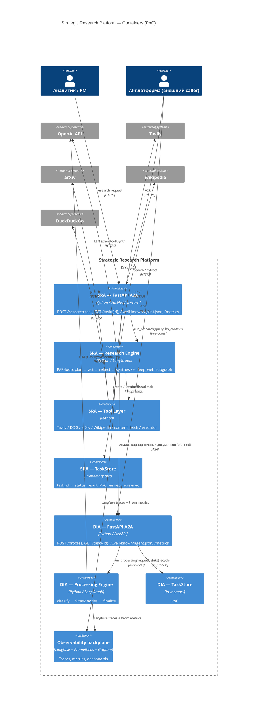

# C4 — Container

Контейнеры внутри Strategic Research Platform: процессы, хранилища, observability backplane.

```mermaid
C4Container
title Strategic Research Platform — Containers (PoC)

Person(analyst, "Аналитик / PM")
Person(platform, "AI-платформа (внешний caller)")

System_Boundary(srp, "Strategic Research Platform") {
    Container(sra_api, "SRA — FastAPI A2A", "Python / FastAPI / Uvicorn", "POST /research-task, GET /task/{id}, /.well-known/agent.json, /metrics")
    Container(sra_engine, "SRA — Research Engine", "Python / LangGraph", "PAR-loop: plan → act → reflect → synthesize, deep_web subgraph")
    Container(sra_tools, "SRA — Tool Layer", "Python", "Tavily / DDG / arXiv / Wikipedia / content_fetch / executor")
    Container(sra_store, "SRA — TaskStore", "In-memory dict", "task_id → status, result; PoC, не персистентно")

    Container(dia_api, "DIA — FastAPI A2A", "Python / FastAPI", "POST /process, GET /task/{id}, /.well-known/agent.json, /metrics")
    Container(dia_engine, "DIA — Processing Engine", "Python / LangGraph", "classify → 9 task nodes → finalize")
    Container(dia_store, "DIA — TaskStore", "In-memory", "PoC")

    Container(obs, "Observability backplane", "Langfuse + Prometheus + Grafana", "Traces, metrics, dashboards")
}

System_Ext(openai, "OpenAI API")
System_Ext(tavily, "Tavily")
System_Ext(arxiv, "arXiv")
System_Ext(wiki, "Wikipedia")
System_Ext(ddg, "DuckDuckGo")

Rel(analyst, sra_api, "research request", "HTTPS")
Rel(platform, sra_api, "A2A", "HTTPS")
Rel(platform, dia_api, "A2A", "HTTPS")

Rel(sra_api, sra_engine, "run_research(query, kb_context)", "in-process")
Rel(sra_api, sra_store, "create / update / read task", "in-process")
Rel(sra_engine, sra_tools, "tool calls", "in-process")
Rel(sra_engine, openai, "LLM (plan/tool/synth)", "HTTPS")
Rel(sra_tools, tavily, "search / extract", "HTTPS")
Rel(sra_tools, ddg, "fallback", "HTTPS")
Rel(sra_tools, arxiv, "search", "HTTPS")
Rel(sra_tools, wiki, "REST", "HTTPS")

Rel(dia_api, dia_engine, "run_processing(request, docs)", "in-process")
Rel(dia_api, dia_store, "task lifecycle", "in-process")
Rel(dia_engine, openai, "LLM (classify/tasks/finalize)", "HTTPS")

Rel(sra_engine, obs, "Langfuse traces + Prom metrics")
Rel(dia_engine, obs, "Langfuse traces + Prom metrics")

Rel(sra_engine, dia_api, "Анализ корпоративных документов (planned)", "A2A")
```
