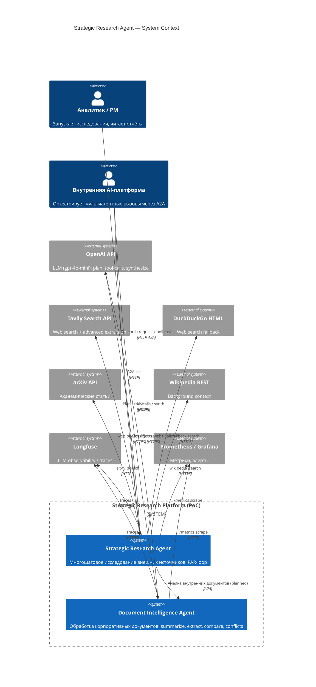

# C4 — Context

Границы системы Strategic Research Agent (PoC). Показывает кто и зачем взаимодействует с системой и какие внешние сервисы она использует.

```mermaid
C4Context
title Strategic Research Agent — System Context

Person(analyst, "Аналитик / PM", "Запускает исследования, читает отчёты")
Person(platform, "Внутренняя AI-платформа", "Оркестрирует мультиагентные вызовы через A2A")

System_Boundary(sra_sys, "Strategic Research Platform (PoC)") {
    System(sra, "Strategic Research Agent", "Многошаговое исследование внешних источников, PAR-loop")
    System(dia, "Document Intelligence Agent", "Обработка корпоративных документов: summarize, extract, compare, conflicts")
}

System_Ext(openai, "OpenAI API", "LLM (gpt-4o-mini): plan, tool-calls, synthesize")
System_Ext(tavily, "Tavily Search API", "Web search + advanced extraction")
System_Ext(ddg, "DuckDuckGo HTML", "Web search fallback")
System_Ext(arxiv, "arXiv API", "Академические статьи")
System_Ext(wiki, "Wikipedia REST", "Background context")
System_Ext(langfuse, "Langfuse", "LLM observability / traces")
System_Ext(prom, "Prometheus / Grafana", "Метрики, алерты")

Rel(analyst, sra, "Research request / poll task", "HTTP A2A")
Rel(platform, sra, "A2A call", "HTTP")
Rel(platform, dia, "A2A call", "HTTP")
Rel(sra, dia, "Анализ внутренних документов (planned)", "A2A")

Rel(sra, openai, "Plan / tool-calls / synth", "HTTPS")
Rel(sra, tavily, "web_search / deep_web", "HTTPS")
Rel(sra, ddg, "fallback search", "HTTPS")
Rel(sra, arxiv, "arxiv_search", "HTTPS")
Rel(sra, wiki, "wikipedia_search", "HTTPS")
Rel(dia, openai, "Classify / tasks / finalize", "HTTPS")

Rel(sra, langfuse, "Traces", "HTTPS")
Rel(dia, langfuse, "Traces", "HTTPS")
Rel(sra, prom, "/metrics scrape", "HTTP")
Rel(dia, prom, "/metrics scrape", "HTTP")
```
