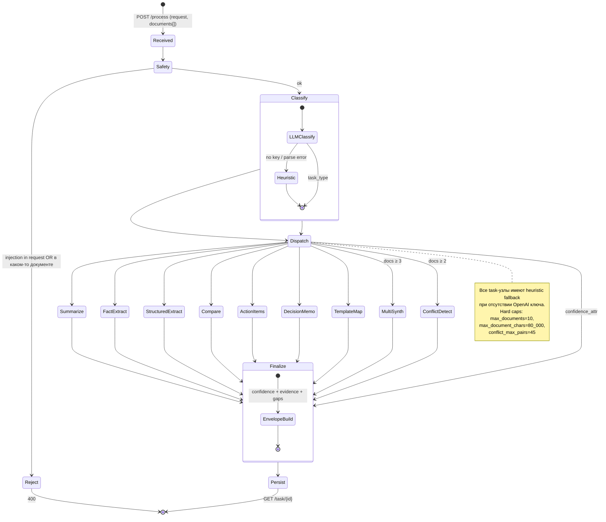

# Workflow — Document Intelligence Agent

```mermaid
stateDiagram-v2
    [*] --> Received: POST /process (request, documents[])
    Received --> Safety
    Safety --> Reject: injection in request OR в каком-то документе
    Reject --> [*]: 400
    Safety --> Classify: ok

    state Classify {
        [*] --> LLMClassify
        LLMClassify --> Heuristic: no key / parse error
        Heuristic --> [*]
        LLMClassify --> [*]: task_type
    }

    Classify --> Dispatch
    state Dispatch <<choice>>
    Classify --> Dispatch

    Dispatch --> Summarize
    Dispatch --> FactExtract
    Dispatch --> StructuredExtract
    Dispatch --> Compare
    Dispatch --> ActionItems
    Dispatch --> DecisionMemo
    Dispatch --> TemplateMap
    Dispatch --> MultiSynth: docs ≥ 3
    Dispatch --> ConflictDetect: docs ≥ 2
    Dispatch --> Finalize: confidence_attr

    Summarize --> Finalize
    FactExtract --> Finalize
    StructuredExtract --> Finalize
    Compare --> Finalize
    ActionItems --> Finalize
    DecisionMemo --> Finalize
    TemplateMap --> Finalize
    MultiSynth --> Finalize
    ConflictDetect --> Finalize

    state Finalize {
        [*] --> EnvelopeBuild: confidence + evidence + gaps
        EnvelopeBuild --> [*]
    }

    Finalize --> Persist
    Persist --> [*]: GET /task/{id}

    note right of Dispatch
        Все task-узлы имеют heuristic fallback
        при отсутствии OpenAI ключа.
        Hard caps: max_documents=10,
        max_document_chars=80_000,
        conflict_max_pairs=45
    end note
```
