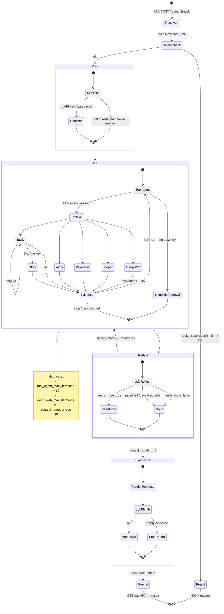

# Workflow — Strategic Research Agent

Пошаговое выполнение research-запроса с явными ветками ошибок и fallback'ов.

```mermaid
stateDiagram-v2
    [*] --> Received: A2A POST /research-task
    Received --> SafetyCheck: build ResearchState

    SafetyCheck --> Reject: looks_suspicious() || len > 32k
    Reject --> [*]: 400 + reason
    SafetyCheck --> Plan: ok

    state Plan {
        [*] --> LLMPlan
        LLMPlan --> Heuristic: no API key / parse error
        Heuristic --> [*]
        LLMPlan --> [*]: task_type, plan_steps, queries
    }

    Plan --> Act

    state Act {
        [*] --> ToolAgent
        ToolAgent --> ToolCall: LLM выбирает tool
        ToolCall --> Tavily
        ToolCall --> Arxiv
        ToolCall --> Wikipedia
        ToolCall --> Scoped
        ToolCall --> DeepWeb

        Tavily --> Tavily: retry x3
        Tavily --> DDG: 5xx / no key
        DDG --> Evidence
        Tavily --> Evidence: ok
        Arxiv --> Evidence
        Wikipedia --> Evidence
        Scoped --> Evidence
        DeepWeb --> Evidence: relevance ≥ 0.45

        Evidence --> ToolAgent: iter < 10
        Evidence --> [*]: stop / cap reached

        ToolAgent --> HeuristicRetrieval: no LLM key
        HeuristicRetrieval --> [*]
    }

    Act --> Reflect

    state Reflect {
        [*] --> LLMReflect
        LLMReflect --> Done: parse fail (caveat added)
        LLMReflect --> NeedMore: needs_more=true
        LLMReflect --> Done: needs_more=false
        NeedMore --> [*]
        Done --> [*]
    }

    Reflect --> Act: needs_more && rounds < 2
    Reflect --> Synthesize: done || rounds == 2

    state Synthesize {
        [*] --> RenderTemplate
        RenderTemplate --> LLMSynth
        LLMSynth --> Markdown: ok
        LLMSynth --> StubReport: empty evidence
        Markdown --> [*]
        StubReport --> [*]
    }

    Synthesize --> Persist: TaskStore.update
    Persist --> [*]: GET /task/{id} → result

    note right of Act
        Hard caps:
        - tool_agent_max_iterations = 10
        - deep_web_max_iterations = 3
        - research_timeout_sec = 90
    end note
```
